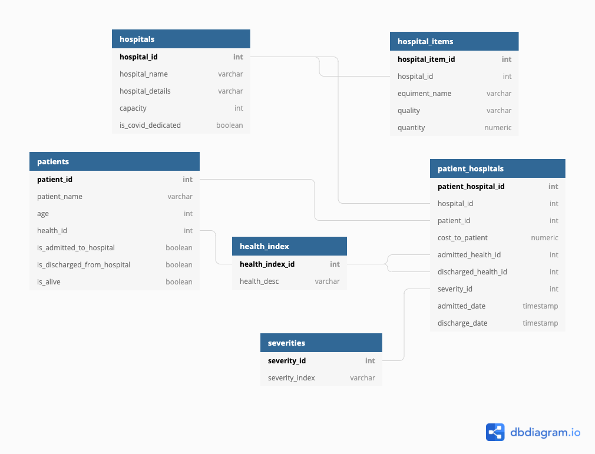
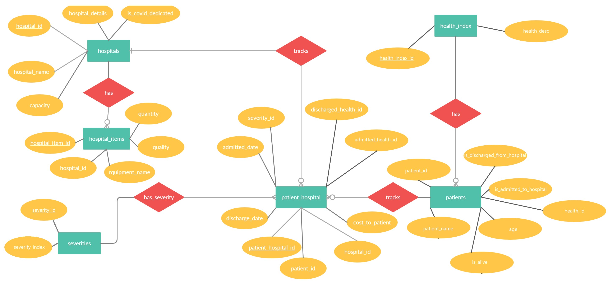

# Myways python Database project
This database project tries to implement a Coronavirus vital information system. This is built using `python 3.6.8` and using **PostgreSQL**.

## Prerequisites:
- Python 3.6.8 or higher
- An acitve internet connection (As the databse is hosted in heroku)

## Installing dependencies:
To install dependencies run `pip install -r requirements.txt`

## Working:
To run the project run `python main.py` from the terminal
- The script will ask you to enter a number to obtain the corresponding information.
- The results will be fetched from the database based on the information required

## Setup the database locally:
To setup the database locally:
- Install PostgreSQL and create a database
- Run `create_tables.py` with your Database URI to setup the database with appropriate tables and data.

## ER Diagram:
The ER diagram for the database is as follows:

## UML Diagram:
The UML diagram for the database is as follows:

